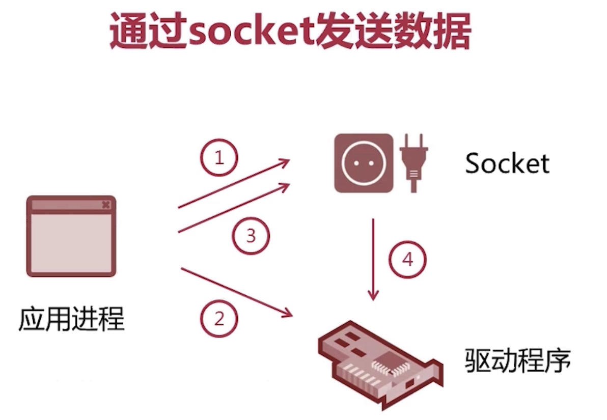
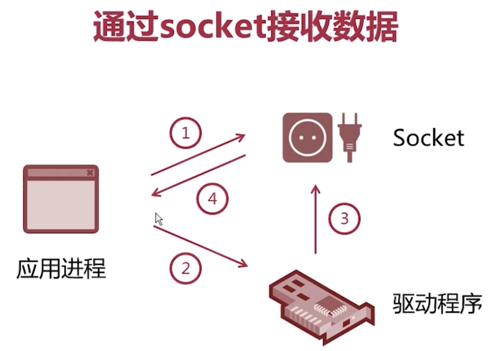

### IO模型

通信的基础是IO模型

本质上就是数据源到应用的数据交换，从数据源到应用是输入流，从应用到数据源叫输出流

IO流

​    字符流

​		Reader

​		Writer

​	字节流

​		InputStream

​		OutputStream

### socket

网络编程中特殊的数据源——socket

socket是网络通信的端点，与本机的端口一一对应，是一个程序层面的逻辑概念

通过socket发送数据

1. 创建socket
2. 告诉网卡驱动，将ip和port绑定到socket
3. 发送数据到soket
4. 通过socket将数据发送给驱动程序

通过socket接收数据

1. 创建socket
2. 告诉网卡驱动，将ip和port绑定到socket
3. 网卡接收数据并发送到指定的socket
4. 应用进程从socket接收数据

### 同步异步阻塞非阻塞

#### 同步 vs 异步

是通信机制上的概念，

同步：调用方调用之后，被调用方处理完之后返回结果

异步：调用方调用之后，被调用放立即返回，但是结果要等被调用方处理完之后再返回

#### 阻塞 vs 非阻塞

是等待调用结果返回前调用方的状态，

阻塞：在结果返回前调用方一直处于等待状态，不能处理其他事

非阻塞：在调用结果返回前调用方可以处理其他事

可以两两排列组合，可能有四种可能：

同步阻塞、同步非阻塞、异步阻塞、异步非阻塞

### 线程池

java提供的线程池

